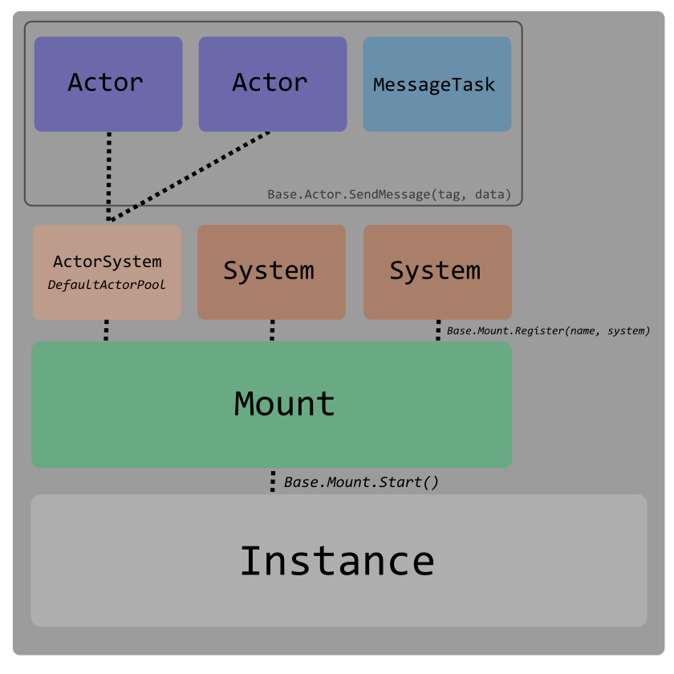

# scriptedeuch

[](https://github.com/Orb-Workshop/scriptedeuch/actions/workflows/main.yml)

**scriptedeuch** is a Library and Framework to be used within CS2
  workshop maps. It is supposed to provide useful tools to ease
  development, and works in tandem with
  [bundledeuch](https://github.com/Orb-Workshop/bundledeuch) to
  quickly develop prototypes for inspiring game modes, custom weapons,
  and your hearts intent.

API Documentation: [here](docs/README.md)

## Quickstart

**scriptedeuch** as a fundamental step employs a *Mount*ing process,
  which works in tandem with System classes.

How you would typically write a CS script
```typescript
import { Instance } from "cs_script/point_script";

function DoSomethingOnActivate() {
  //...
}

function DoSomethingOnActivate2() {
  //...
}

function DoSomethingOnPlayerKill(event) {
  //...
}

function DoSomethingOnPlayerKill2(event) {
  //...
}

function DoSomethingOnPlayerReset(event) {
  //...
}

Instance.OnActivate(() => {
  Instance.Msg("My Scripts are Activated!");
  DoSomethingOnActivate();
  DoSomethingOnActivate2();
});

Instance.OnPlayerKill((event) => {
  DoSomethingOnPlayerKill(event);
  DoSomethingOnPlayerKill2(event);
});

Instance.OnPlayerReset((event) => {
  DoSomethingOnPlayerReset(event);
});

// ...
```


The mounting framework replaces point_script Instance event handling
to allow Systems to work in tandem more easily. Multiple systems can
handle events independently of the Instance event handler.


Here's the same example written using the **scriptedeuch** mounter
`Base.Mount` and systems framework `Base.System`.

```typescript
//import { Instance } from "cs_script/point_script";
import { Base } from "scriptedeuch";

class DoSomething extends Base.System {
  constructor() {
    super();
  }
  
  override OnActivate() {
    // DoSomethingOnActivate()
  }

  override OnPlayerKill(event) {
    // DoSomethingOnPlayerKill(event)
  }

  override OnPlayerReset(event) {
    // DoSomethingOnPlayerReset(event)
  }
}

class DoSomething2 extends Base.System {
  constructor() {
    super();
  }

  override OnActivate() {
    // DoSomethingOnActivate2()
  }

  override OnPlayerKill(event) {
    // DoSomethingOnPlayerKill2(event)
  }
}

// Register system instances with our mounter, give them unique names
Base.Mount.Register("DoSomething", new DoSomething());
Base.Mount.Register("DoSomething2", new DoSomething2());

// Start our mounter.
Base.Mount.Start(); // Attaches Instance.On* events to the registered systems.
```

The separation of concerns and encapsulation of logic into individual
systems allows for easier code re-use.

### I tink, therefore I am.

The mounter also replaces `Instance.SetThink` and
`Instance.SetNextThink` functionality. Systems can override
`Base.System.Think()` and set their own *Tick Rate*. (Default, every available tick, 64-Tick)

```typescript
import { Instance as CSS } from "cs_script/point_script";
import { Base } from "scriptedeuch";

class RepeatingMsgs extends Base.System {
  private num: number = 0;
  public msgs: Array<string>;
  constructor(msgs: Array<string>) {
    super();
    // this.SetTick(128); // Default (pegged at 64-Tick)
    this.SetTickInterval(1); // Every Second
    this.msgs = msgs;
  }

  override Think() {
    const len = this.msgs.length;
    CSS.Msg(this.msgs[this.num++ % len]);
  }
}
Base.Mount.Register("Clock", new RepeatingMsgs(["Tick!", "Tock!"]));
Base.Mount.Start();
```

## Description

### Mount System Actor Model




## Development & Testing

To install dependencies:

```bash
bun install
```

To test:

```bash
bun test
```

To develop:

```bash
bun run build
```

OR

```bash
bun run watch
```

